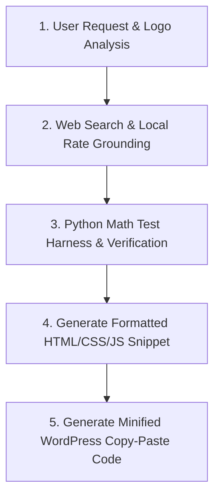

# Global WordPress Cost Calculator Builder Skill

This skill provides an autonomous end-to-end framework to build high-converting, localized, standalone WordPress cost calculator widgets for any trade, service, product, or industry.

---

## 1. Mandatory Design & Branding Directives (STRICT ENFORCEMENT)

When creating, updating, or generating any WordPress cost calculator, ALWAYS enforce the following strict rules:

### A. Deep Logo Color Analysis & Dual-Color Harmony
- **Visual Inspection**: Thoroughly inspect the target website's logo image and extract the exact primary and secondary color palette (Hex codes).
- **Brand System**:
  - **Primary Logo Color**: Apply to primary action buttons, active tab/segmented pill backgrounds, header titles, focus borders, and main breakdown bar segments.
  - **Secondary Logo Color**: Apply to active pill bottom accent indicators (`border-bottom: 3px solid`), secondary borders, badge highlights, legend tags, and CTA accents.

### B. Centered Header Section & Location Badge Revocation
- **Centering (STRICT MANDATE)**: The header block (Main Calculator Title and Subtitle) **MUST ALWAYS be centered** (`text-align: center; margin: 0 auto;`).
- **Location Badge**: Optional location badge above the title can be included or revoked/removed per user preference while keeping the title and subtitle centered.
- **Forbidden**: NEVER left-align or right-align the top calculator header title block.

### C. Calculator Container Background (STRICT MANDATE)
- **Background Color**: You MUST **ONLY use `#FFFFFF`** (Pure White) as the background color code for all calculator containers (`background: #FFFFFF;` or `--card-bg: #FFFFFF;`).
- **Forbidden**: NEVER use grey (`#F8FAFC`, `#F1F5F9`), dark, or tinted backgrounds for the main calculator container box.

### D. Text-Only Option Pills & Ultra-Compressed Space Mode
- **Text-Only Option Pills**: Segmented pill selectors (Factor 1 & Factor 3) support clean, text-only styling without icons to eliminate unnecessary vertical height.
- **Space Compression**: Compress button padding (`8px 10px`), gap spacing (`6px`), and form margins to maximize screen real-estate efficiency.

### E. Universal Container Bounds
- **Container Max-Width**: Default MUST ALWAYS be `max-width: 100%` for fluid, flawless responsive rendering across PC header right areas, sidebars, body contents, and mobile viewports.

---

## 2. Minimal User Inputs Required

When the user provides minimal input, extract or request the following key variables:

| Input Variable | Description / Example | Default Value (If Unspecified) |
| :--- | :--- | :--- |
| **Location** | City, Zip, or Region (e.g., `Barrie, ON`) | `Barrie, ON` (COLA: 1.08x) |
| **Calculator Keyword** | Target SEO Keyword (e.g., `Concrete Cost Calculator Barrie`) | Prompt or infer from user context |
| **Color Palette** | Primary & Secondary Logo Hex Codes | Extracted from logo image |
| **Font Family** | Google Font or standard font stack | `'Poppins', sans-serif` |
| **Container Width** | Max-width constraint for fluid responsive layout | `max-width: 100%` |

---

## 3. Standard Operational Workflow



### Step 1: Web Search & Local Rate Grounding
Use `search_web` to retrieve localized cost metrics for the target keyword in the specified location:
- Local Trade Labor Hourly Rate (e.g., Concrete contractor/Glazier/Electrician baseline).
- Material Unit Rates (Base materials, premium tiers, addons).
- Local Building Codes & Regional Factors.

### Step 2: Math Verification via Python Test Harness
Create a python script in scratch (e.g., `verify_[service]_calculator.py`) using `write_to_file`, then execute it using `run_command`:
- Verify all formula outputs, range bounds (Min: -10%, Max: +12%), unit subtotals, and edge cases.
- Confirm Exit Code 0 before generating frontend HTML code.

### Step 3: Standalone WordPress Code Generation (`-snippet.html`)
Build a 100% self-contained module containing:
1. **Centered Header**: Title, subtitle, and optional location badge.
2. **Streamlined 3-Factor Input Controls**:
   - Factor 1: Service / Project Type (Text-Only or Icon Segmented Pill Buttons)
   - Factor 2: Size / Scope (Interactive Slider with quick preset chips)
   - Factor 3: Thickness & Finish Tier (Text-Only or Icon Pill Selector)
3. **Ultra-Simple & High-Impact Results Display**:
   - Hero Price Display: Bold total investment price, estimated range, and unit rate.
   - Clean 4-Line Item Breakdown: Itemized list with subtotals.
   - Phone CTA Banner: Click-to-call contact box for direct lead conversion (`📞 Call Now`).
4. **Interactive 5-Second Auto-Close Results Card**:
   - Initial state: `style="display: none;"`
   - Trigger: Clicking **"Calculate Cost"** button displays card, scrolls smoothly into view, and starts `bccStartTimer()`.
   - Countdown Progress Bar: Top animated bar shrinking from 100% to 0% over 5 seconds (5000ms).
   - Hover Pause: `onmouseenter="bccPauseTimer()"` pauses timer, `onmouseleave="bccResumeTimer()"` resumes timer.
   - Manual Close: Includes `✖ Minimize` button calling `bccCloseResults()`.

### Step 4: Automated Minification Pipeline (`-minified.html`)
Write a python minification script (e.g., `minify_[service].py`) that strips comments and unnecessary whitespace from HTML, CSS, and JS. Run via `run_command` and present both Option 1 (Minified Code) and Option 2 (Formatted Code).

---

## 4. Standardized Multi-Vector Pricing Formula

$$\text{Total Investment} = \left[ \left( \text{Base Material Rate} \times \text{Quantity/Area} \times \text{Finish Multiplier} \right) + \text{Design Cost} + \text{Utility Cost} + \text{Permit Fee} \right] \times \text{Regional COLA Multiplier}$$

Where:
- **Min Estimate**: $\text{Total} \times 0.92$
- **Max Estimate**: $\text{Total} \times 1.12$
- **Unit Metric**: $\text{Total} / \text{Quantity or Sq.Ft.}$

---

## 5. Output Deliverable Formatting Guide

When presenting the output to the user, always provide:
1. **Option 1: Compressed / Minified WordPress Code**: Wrapped in a single ````html ```` block ready for copy-pasting into Gutenberg / Elementor / Divi.
2. **Option 2: Formatted Code**: Cleanly indented code with inline comments for users who wish to customize field options or pricing constants.
3. **Local Scratch File References**: Links to `[service]-snippet.html` and `[service]-minified.html`.
