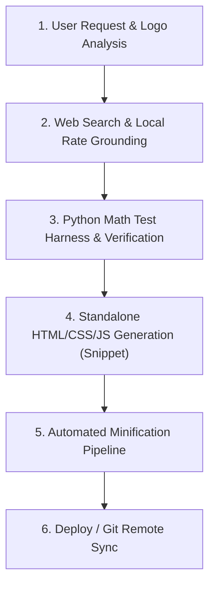

# Global WordPress Cost Calculator Builder Skill

This skill provides an autonomous end-to-end framework to build high-converting, localized, standalone WordPress cost calculator widgets for any trade, service, product, or industry (roofing, concrete, HVAC, plumbing, solar, remodeling, commercial services).

---

## 1. Mandatory Design & Branding Directives (STRICT ENFORCEMENT)

When creating, updating, or generating any WordPress cost calculator, ALWAYS enforce the following strict rules:

### A. Deep Logo Color Analysis & Dual-Color Harmony
- **Visual Inspection**: Thoroughly inspect the target website's logo image and extract the exact primary and secondary color palette (Hex codes).
- **Brand System Mapping**:
  - **Primary Logo Color**: Apply to primary action buttons, active tab/segmented pill backgrounds, header titles, focus borders, and main breakdown bar segments.
  - **Secondary Logo Color**: Apply to badges, highlight accents, active tab borders/indicators, legend tags, and secondary action elements.

### B. Centered Header Section (STRICT MANDATE)
- **Centering**: The header block (Main Calculator Title and Subtitle) **MUST ALWAYS be centered** (`text-align: center; margin: 0 auto;`).
- **Location Badge**: Optional location badge above the title can be included or removed per user preference while keeping the title centered.
- **Forbidden**: NEVER left-align or right-align the top calculator header title block.

### C. Calculator Container Background (STRICT MANDATE)
- **Background Color**: You MUST **ONLY use `#FFFFFF`** (Pure White) as the background color code for all calculator containers (`background: #FFFFFF;` or `--card-bg: #FFFFFF;`).
- **Forbidden**: NEVER use grey (`#F8FAFC`, `#F1F5F9`), dark, or tinted backgrounds for the main calculator container box.

### D. Universal Container Bounds
- **Container Max-Width**: Default MUST ALWAYS be `max-width: 100%` for fluid, flawless responsive rendering across PC header right areas, sidebars, body contents, and mobile viewports.

---

## 2. Input Form Controls & Layout Best Practices

### A. Concise, Unclipped Dropdown Options (< 35 Characters)
In narrow hero right columns or sidebar containers (~280px–340px), verbose dropdown option labels get truncated with `...` by the browser.
- **Rule**: Keep all `<option>` text concise, plain-English, and under 35 characters so the label is 100% visible before the dropdown arrow.
- **Example**:
  - *Poor*: `Class 4 Impact-Resistant (Hail-Rated • Omaha Top Pick • ~$6.40/sq.ft)` (Truncates to `Class 4 Impact-Resistant (Hail-...`)
  - *Best*: `Class 4 Impact (Hail Resistant)` (32 chars — fits cleanly in all viewports).

### B. Stacked Custom Area / Dimension Entries
- Never put dropdown presets and custom numeric inputs in narrow 50/50 side-by-side columns.
- Use a **full-width stacked layout**:
  1. Full-width preset dropdown on top.
  2. Direct custom entry card below with an input field, right suffix tag (`sq ft`), and an adjacent counter pill (`24 Squares`).

---

## 3. Results Architecture: Lightbox Modal Pop-Up Protocol

When the user requests a pop-up modal or lightbox results window, enforce the following architecture:

### A. Strictly Hidden by Default on Page Load
- The modal overlay MUST have `display: none !important;` in CSS and inline `style="display: none !important;"` to prevent themes or CSS transitions from displaying it prematurely on load.
- It is activated exclusively via `.jbr-modal-active { display: flex !important; }` when the user clicks the "Calculate" button.

### B. Astra / WordPress Theme-Immune Close Button
Themes like Astra inject global styles onto `<button>` elements (`padding: 15px 30px; border-radius: 4px; font-size: 16px;`). To guarantee a pristine circular close button:
```css
.jbr-modal-dialog .jbr-close-modal-btn,
button.jbr-close-modal-btn,
.jbr-close-modal-btn {
  all: unset !important;
  box-sizing: border-box !important;
  width: 34px !important;
  height: 34px !important;
  min-width: 34px !important;
  max-width: 34px !important;
  min-height: 34px !important;
  max-height: 34px !important;
  padding: 0 !important;
  margin: 0 !important;
  background: #F1F5F9 !important;
  border: 1.5px solid #CBD5E1 !important;
  border-radius: 50% !important;
  display: inline-flex !important;
  align-items: center !important;
  justify-content: center !important;
  cursor: pointer !important;
  color: #1E293B !important;
  transition: all 0.2s ease !important;
}
```

### C. 5-Second Auto-Close Countdown with Hover Pause
- Top countdown progress bar shrinks from 100% to 0% over 5 seconds (5000ms).
- `onmouseenter="bccPauseTimer()"` pauses the countdown when the user hovers over the dialog.
- `onmouseleave="bccResumeTimer()"` resumes the countdown.
- Dismissible via click on backdrop overlay and `Escape` key listener.

---

## 4. Isolated 1-Page PDF Print Engine (`jbrPrintEstimate`)

Calling generic `window.print()` from a WordPress / Elementor page often prints 10–16 pages of website clutter and splits the estimate card across pages. 

### Implementation Standard:
When the user clicks "Print PDF", dynamically inject an isolated print document into a hidden `<iframe>`:
```javascript
window.jbrPrintEstimate = function() {
  var totalPrice = document.getElementById('jbr-total-price').textContent;
  var rangePrice = document.getElementById('jbr-range-price').textContent;
  var unitSqft = document.getElementById('jbr-unit-sqft').textContent;
  var unitSquare = document.getElementById('jbr-unit-square').textContent;
  
  var printHtml = '<!DOCTYPE html><html><head><meta charset="utf-8">' +
    '<title>Official Estimate - ' + totalPrice + '</title>' +
    '<style>' +
    '@page { size: letter portrait; margin: 10mm 12mm; }' +
    '* { box-sizing: border-box; font-family: -apple-system, BlinkMacSystemFont, "Segoe UI", Roboto, Arial, sans-serif; }' +
    'body { margin: 0; padding: 0; color: #0F172A; background: #FFF; font-size: 12.5px; line-height: 1.38; }' +
    '.quote-card { border: 2px solid #1E293B; border-radius: 10px; padding: 20px 24px; max-width: 680px; margin: 0 auto; }' +
    '/* Clean header, specs bar, hero price box, itemized breakdown, and contact CTA */' +
    '</style></head><body>' +
    '<div class="quote-card">' +
      '<!-- Clean 1-Page Quote Body -->' +
    '</div></body></html>';

  var printFrame = document.getElementById('jbr-print-iframe');
  if (!printFrame) {
    printFrame = document.createElement('iframe');
    printFrame.id = 'jbr-print-iframe';
    printFrame.style.position = 'fixed';
    printFrame.style.right = '0';
    printFrame.style.bottom = '0';
    printFrame.style.width = '0';
    printFrame.style.height = '0';
    printFrame.style.border = '0';
    document.body.appendChild(printFrame);
  }

  var frameDoc = printFrame.contentWindow || printFrame.contentDocument;
  if (frameDoc.document) frameDoc = frameDoc.document;
  frameDoc.open();
  frameDoc.write(printHtml);
  frameDoc.close();

  setTimeout(function() {
    printFrame.contentWindow.focus();
    printFrame.contentWindow.print();
  }, 250);
};
```
- **Guaranteed Output**: Exactly **Page 1 of 1** letter-sized PDF estimate.
- **Omission**: Automatically strips the close button, countdown bar, and website chrome.

---

## 5. Direct Conversion CTA Group

In the results modal / output card, provide high-converting lead actions:
1. **Contact Us Button**: Direct link to the client's booking or contact page (e.g., `https://[client-domain]/contact/`).
2. **Direct Phone Call Button**: One-tap phone link (`tel:[phone]`).
3. **Print PDF Button**: One-click 1-page estimate generator.

---

## 6. Standard Operational Workflow



### Step 1: Web Search & Rate Grounding
Extract hourly labor rates, material square foot pricing, and local permit fees.

### Step 2: Math Verification Harness
Verify formula calculations using a Python test harness before generating HTML.
$$\text{Total} = \left[ \left(\text{Quantity} \times \text{Material Rate} \times \text{Multiplier}\right) \times \text{Regional Factor} \right] + \text{Permits}$$

### Step 3: Standalone Code Generation
Produce clean, self-contained HTML/CSS/JS without external CDN dependencies.

### Step 4: Automated Minification Pipeline
Write a Python script to compress HTML, CSS, and JS into a copy-and-paste single block for WordPress Gutenberg / Elementor HTML widgets.
